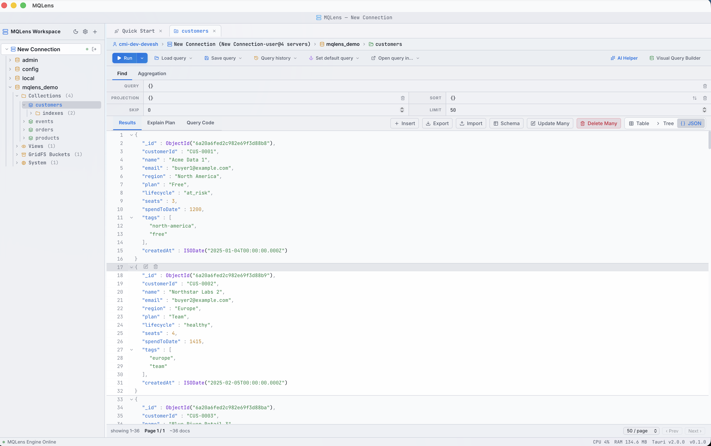
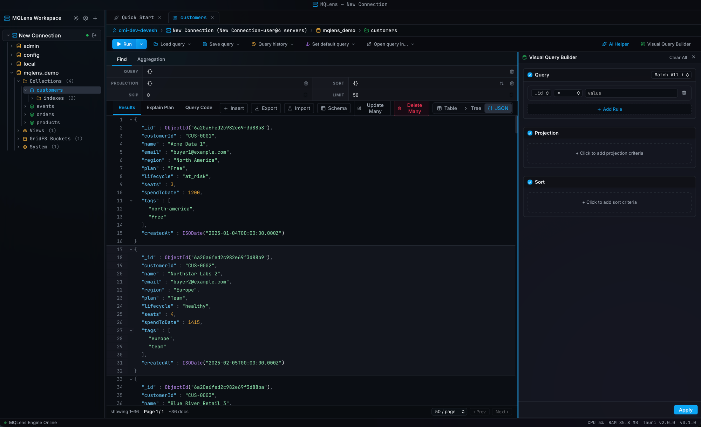
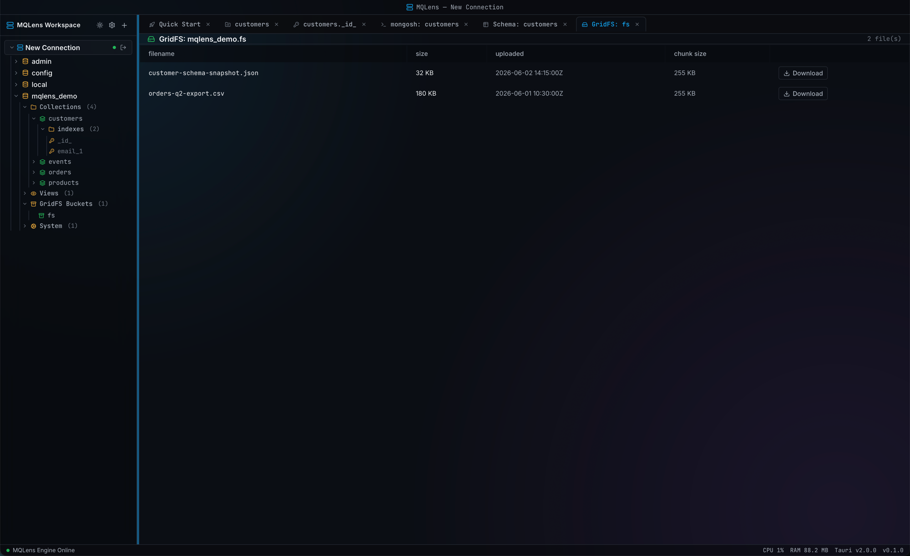

# MQLens

[](https://github.com/mqlens/mqlens-mongodb/actions/workflows/ci.yml)
[](.github/workflows/ci.yml)
[](https://github.com/mqlens/mqlens-mongodb/releases)
[](https://github.com/mqlens/mqlens-mongodb/releases)
[](https://github.com/mqlens/mqlens-mongodb/stargazers)
[](LICENSE)

**A fast, native desktop GUI for MongoDB** — built with [Tauri](https://tauri.app)
(Rust) and React + TypeScript.

🌐 Website: **[mqlens.com](https://mqlens.com)**

MQLens lets you connect to real MongoDB deployments, browse your data, run
queries and aggregations, manage indexes and views, and inspect what your
queries actually do — from a single cross-platform desktop app.

> **In short:** point MQLens at any MongoDB (with TLS / SSH / proxy and every
> auth mechanism), then browse, query, aggregate, explain, edit in bulk, manage
> indexes and views, analyze schemas, browse GridFS, and run an embedded
> `mongosh` — with credentials encrypted behind a master password.

## Demo


## Screenshots

[](website/public/screenshots/mqlens-documents.png)

| Query tools | GridFS |
| --- | --- |
| [](website/public/screenshots/mqlens-visual-builder.png) | [](website/public/screenshots/mqlens-gridfs.png) |

## Features

- **Connections** — standalone, replica set, or raw connection string; TLS
  (system CA, custom CA file, client certificate), SSH tunnel, and SOCKS5 proxy;
  configurable connect / server-selection timeouts. A staged "Test Connection"
  reports each real phase (parse → DNS resolve → connect → ping).
- **Authentication** — SCRAM-SHA-1/256, X.509, `MONGODB-AWS` (IAM, incl. session
  token), GSSAPI/Kerberos, and LDAP (PLAIN), with the correct `$external`
  plumbing.
- **Browse** — databases, collections, views, GridFS buckets, and system
  collections in a tree.
- **Query** — `find` with filter / sort / projection / skip / limit and
  pagination; a visual query builder; full **aggregation pipelines**; and
  **explain plans** (find *and* full-pipeline aggregate) with a visual plan tree.
- **Documents** — view, insert, edit, and delete; **bulk** update-many /
  delete-many by filter with a counted, guarded confirmation.
- **Indexes** — create, inspect (real key pattern + unique/sparse), and drop.
- **Collections & views** — create / drop / rename collections and databases;
  create aggregation-backed **views**.
- **Schema analysis** — sample a collection and see per-field types and presence
  / coverage (including nested paths).
- **GridFS** — browse files in a bucket and download them to disk.
- **Import / export** — JSON and CSV, including full-collection background
  exports.
- **Data generation** — seed collections with realistic fake documents:
  schema-aware templates, nested objects and arrays, preview before you
  insert, background tasks for big counts.
- **mongosh shell** — an embedded shell backed by a real `mongosh` binary.
- **AI query assistant** — natural-language → MQL generation, with multiple
  providers (Anthropic / OpenAI / Gemini and local agent CLIs); the API key
  stays in the backend.
- **Encrypted credentials** — a master password gates the app; connection
  profiles and settings are encrypted at rest with AES-256-GCM (Argon2id key
  derivation).
- **Split panes** — drag a tab to any pane edge to split the workspace; compare
  collections side by side, keep a shell under your results.
- **Detachable windows** — pop a tab out into its own window and spread your
  workspace across monitors.
- **Session restore** — your splits and tabs come back after a restart;
  reconnect per connection with one click.
- **MCP server** — expose your connections to Claude Code, Cursor, and other agents as
  [Model Context Protocol tools](docs/mcp-tools.md); per-connection opt-in, writes gated behind
  explicit confirmation, off by default.

## Install

Grab the latest build for your OS from
**[Releases](https://github.com/mqlens/mqlens-mongodb/releases/latest)**:

- **macOS** — download the `.dmg` (Apple-notarized; Touch ID unlock supported).

### Windows

Download the `.exe` or `.msi` installer from the
[latest release](https://github.com/mqlens/mqlens-mongodb/releases/latest).
Requires Windows 10 or later (x64). Installers are signed via Azure Trusted
Signing.

**Setup (.exe, recommended)**

1. Double-click `MQLens_*_x64-setup.exe`.
2. Approve the UAC prompt if Windows asks for permission.
3. Follow the setup wizard, then launch **MQLens** from the Start menu.

**Setup (.msi)**

Double-click `MQLens_*.msi` and follow the prompts, or install from an elevated
Command Prompt or PowerShell:

```powershell
msiexec /i MQLens_*.msi
```

If SmartScreen shows "Windows protected your PC", choose **More info** → **Run
anyway**. The installer is signed; SmartScreen may still warn on first download
until reputation builds.

### Linux

Download the `.deb` or `.AppImage` from the
[latest release](https://github.com/mqlens/mqlens-mongodb/releases/latest).

**Debian / Ubuntu (.deb)**

```bash
sudo apt install ./MQLens_*.deb
# or:
sudo dpkg -i MQLens_*.deb
```

**Any distro (.AppImage)**

```bash
chmod +x MQLens_*.AppImage
./MQLens_*.AppImage
```

If the AppImage won't start ("Permission denied"), the execute bit was likely
stripped on download — run `chmod +x` on the file again.

No account, no sign-up, no telemetry.

## Trust & privacy

- **No telemetry** — nothing is tracked or phoned home.
- **No account required** — just download and connect.
- **Credentials encrypted locally** with AES-256-GCM and Argon2id key derivation.
- **Signed release assets** (detached signatures on every artifact).
- **macOS notarized** builds and **Windows signed** installers.
- **Apache-2.0** — fully open source.

## MQLens vs. the alternatives

| | MQLens | Compass | Studio 3T |
|---|---|---|---|
| Price | **Free (Apache-2.0)** | Free | Paid |
| Engine | **Native (Tauri/Rust)** | Electron | Java |
| Enterprise auth (X.509 / AWS / Kerberos / LDAP) | ✅ | ✅ | ✅ |
| SSH tunnel | ✅ | ✅ | ✅ |
| SOCKS5 proxy | ✅ | Not clearly exposed | Varies |
| Aggregation + explain tree | ✅ | ✅ | ✅ |
| Embedded `mongosh` | ✅ | ✅ | ✅ |
| AI query assistant (bring-your-own key) | ✅ | ✅ | partial |
| Biometric-unlocked encrypted vault | ✅ | ❌ | partial |
| Telemetry | **None** | yes | yes |

*Comparison reflects publicly documented behavior at time of writing; tools change — corrections welcome via an issue.*

## Tech stack

- **Frontend:** React 19 + TypeScript, Vite, Tailwind-style utility CSS.
- **Backend:** Rust, Tauri v2, the official `mongodb` driver.
- **Tests:** Vitest + Testing Library (frontend), `cargo test` (backend).

## Prerequisites

- [Node.js](https://nodejs.org/) 18+
- [Rust](https://www.rust-lang.org/tools/install) (stable) and the
  [Tauri prerequisites](https://tauri.app/start/prerequisites/) for your OS
- [`mongosh`](https://www.mongodb.com/docs/mongodb-shell/) on your `PATH` (only
  needed for the embedded shell)

## Development

```bash
npm install
npm run tauri dev      # run the desktop app with hot reload
```

For something to point the app at, seed the
[local demo database](docs/demo-database.md) — synthetic collections, indexes,
a view, and GridFS files that exercise every major workflow (and match the
screenshots above).

Other useful commands:

```bash
npm run dev            # frontend only (browser, no Tauri APIs)
npm test               # frontend tests (Vitest)
npm run coverage:frontend   # frontend tests with coverage
cargo test --manifest-path src-tauri/Cargo.toml   # backend tests
cargo llvm-cov --manifest-path src-tauri/Cargo.toml --summary-only --ignore-filename-regex 'src-tauri/src/(lib|main)\.rs'   # backend coverage
npm run build          # type-check + build the frontend bundle
```

The backend integration tests (and the coverage figure CI reports) need a real
MongoDB. They skip automatically when `MQLENS_TEST_MONGO_URI` is unset, so set it
to exercise the live database paths:

```bash
docker run -d -p 27017:27017 mongo:7
MQLENS_TEST_MONGO_URI=mongodb://localhost:27017 \
  cargo llvm-cov --manifest-path src-tauri/Cargo.toml --summary-only --ignore-filename-regex 'src-tauri/src/(lib|main)\.rs'
```

## Build

```bash
npm run tauri build    # produce a platform installer / bundle
```

## Security

- Connection credentials and settings are encrypted at rest behind a master
  password; nothing is stored in plaintext once the vault is initialized.
- Disabling TLS certificate validation is an explicit, opt-in choice (with an
  in-app warning), never silent.
- AI provider API keys are held in the backend, out of the frontend bundle.

> MQLens talks directly to whatever MongoDB deployment you point it at. Use the
> usual care with production credentials.

## Verifying downloads

Every release asset is shipped with a detached GPG signature (`.asc`), and the
macOS bundles are also Apple-notarized. To verify a download:

```bash
# Import the MQLens release public key (once):
gpg --import KEYS          # from this repo, or: curl -L https://mqlens.com/KEYS | gpg --import

# Verify an asset against its .asc:
gpg --verify MQLens_0.1.0_amd64.deb.asc MQLens_0.1.0_amd64.deb
```

Signing key — **MQLens Releases `<dev@mqlens.com>`**, fingerprint:

```
8E10 C09D 1FEC 8C8F 90B1  DB7E 5804 6649 06E7 D373
```

## License

Licensed under the [Apache License 2.0](LICENSE).
