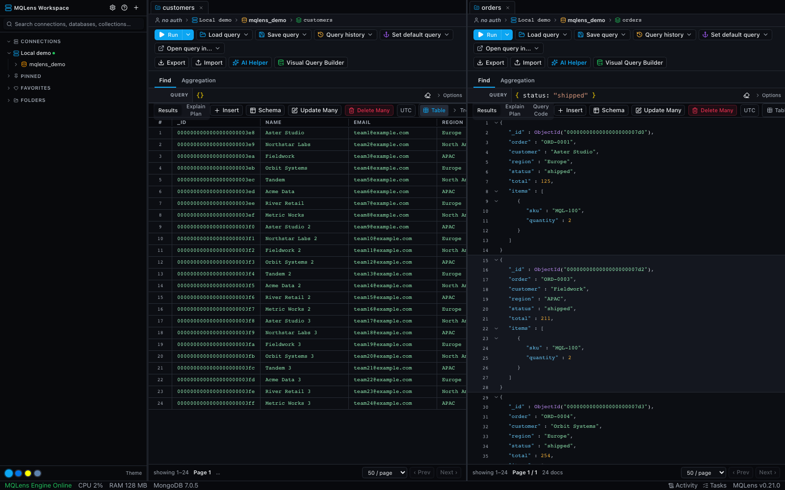
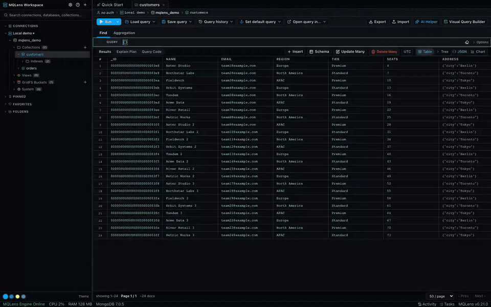
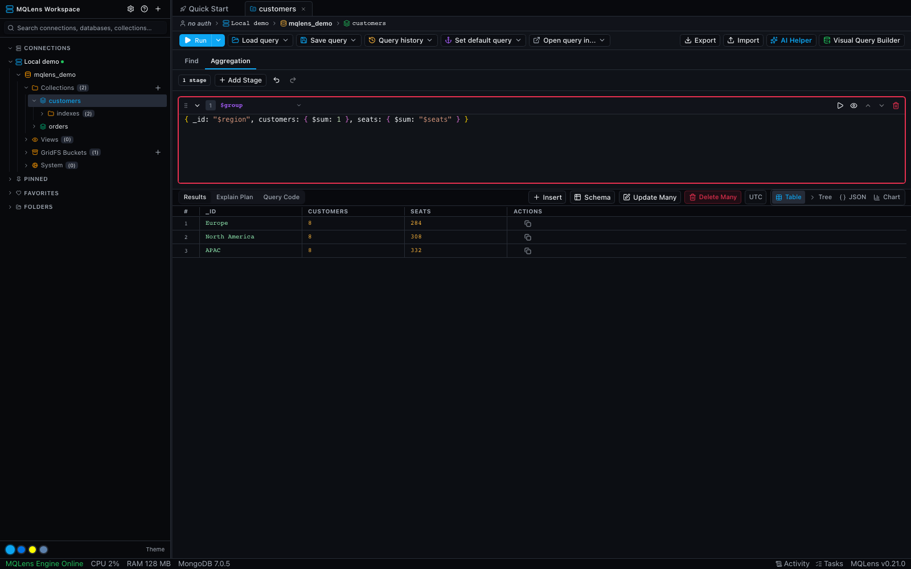
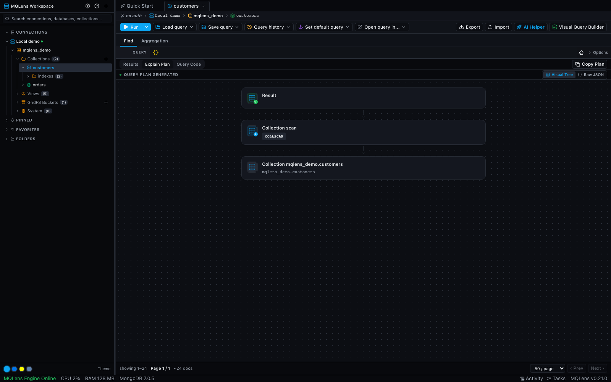

# MQLens

**Browse, query, and understand MongoDB.** A free, open-source desktop workspace for macOS, Windows, and Linux.

**[Download MQLens](https://mqlens.com/#download)** · [Watch the demo](https://mqlens.com/demo/) · [Documentation](https://mqlens.com/docs/) · [Website](https://mqlens.com)

*Screenshots and demos use sample data, including illustrative query results and execution statistics.*

## From a collection to an answer

- **Explore documents.** Switch between table, tree, and JSON views; filter, sort, edit, and export results.
- **Understand your queries.** Build aggregation pipelines, inspect visual explain plans, and manage indexes.
- **Arrange your workspace.** Split panes, detach tabs into separate windows, and restore your session.
- **Connect to your deployments.** Use MongoDB connection strings, SSH tunnels, TLS, and supported authentication methods.
- **Work with safeguards.** Choose read-only connections or confirmations for destructive operations. Credentials are encrypted locally behind a master password.
- **Use AI when you want it.** Review editable MQL from the optional query assistant, or explicitly enable selected connections for an MCP-compatible agent.

[See all features](https://mqlens.com/features/), including schema analysis, GridFS, synthetic data generation, import/export, and the embedded `mongosh` shell.

## MQLens Server — coming soon

A self-hosted backend for teams is coming soon, bringing centralized MongoDB credentials, access controls, and audit logs. MQLens Server will be a separate paid product; the desktop app stays free and open source. [Explore MQLens Server](https://mqlens.com/mqlens-server/) or [follow the project](https://github.com/mqlens/mqlens-server).

## Install and run your first query

Get the [latest release](https://github.com/mqlens/mqlens-mongodb/releases/latest) or choose an installer on the [download page](https://mqlens.com/#download).

| Platform | Installer | Get started |
| --- | --- | --- |
| macOS | `.dmg` for Apple Silicon or Intel | Open the disk image and drag MQLens into Applications. |
| Windows | `.exe` or `.msi` for x64 | Run the installer, then launch MQLens from the Start menu. |
| Linux | `.deb`, `.rpm`, or `.AppImage` | Use your package manager, or make the AppImage executable. |

1. Open MQLens and create your local credential vault.
2. Add a MongoDB connection, or explore the built-in sample data.
3. Open a collection, enter a filter, and run your query.

See [installation and connection help](https://mqlens.com/docs/). The optional embedded shell needs [`mongosh`](https://www.mongodb.com/docs/mongodb-shell/) installed; ordinary GUI queries do not.

## A quick look

[Watch the full demo and explore the workflows](https://mqlens.com/demo/).

| Build an aggregation | Read an explain plan |
| --- | --- |
|  |  |

## Trust and privacy

- No account required and no app telemetry.
- Connection credentials and settings are encrypted locally with AES-256-GCM and an Argon2id-derived key.
- Read-only and destructive-operation controls complement your MongoDB permissions and backups.
- AI is optional. Configured providers or agent clients may receive prompts, schema context, and tool results. Keeping a key in the backend does not mean AI processing stays on your device.
- MCP is off by default, enabled per connection, and has write confirmation controls. Read the [MCP tool reference](docs/mcp-tools.md) before enabling it.
- Releases include verification information. See [how to verify downloads](docs/verifying-downloads.md) and the [security policy](.github/SECURITY.md).

Choosing between tools? Read the [MongoDB Compass](https://mqlens.com/compare/mongodb-compass-alternative/) and [Studio 3T](https://mqlens.com/compare/studio-3t-alternative/) comparisons.

## Contribute

MQLens uses React and TypeScript for its interface, with Tauri and Rust behind it. Bug reports, documentation fixes, translations, and code contributions are welcome.

- [Development setup and test commands](docs/development.md)
- [Contribution guide](.github/CONTRIBUTING.md) and [translation guide](docs/CONTRIBUTING-i18n.md)
- [Local demo database](docs/demo-database.md)
- [Good first issues](https://github.com/mqlens/mqlens-mongodb/labels/good%20first%20issue) and [roadmap](docs/ROADMAP.md)
- [Report a bug](https://github.com/mqlens/mqlens-mongodb/issues/new?template=bug_report.yml)

## License

[Apache-2.0](LICENSE). Free to use, inspect, and improve.
